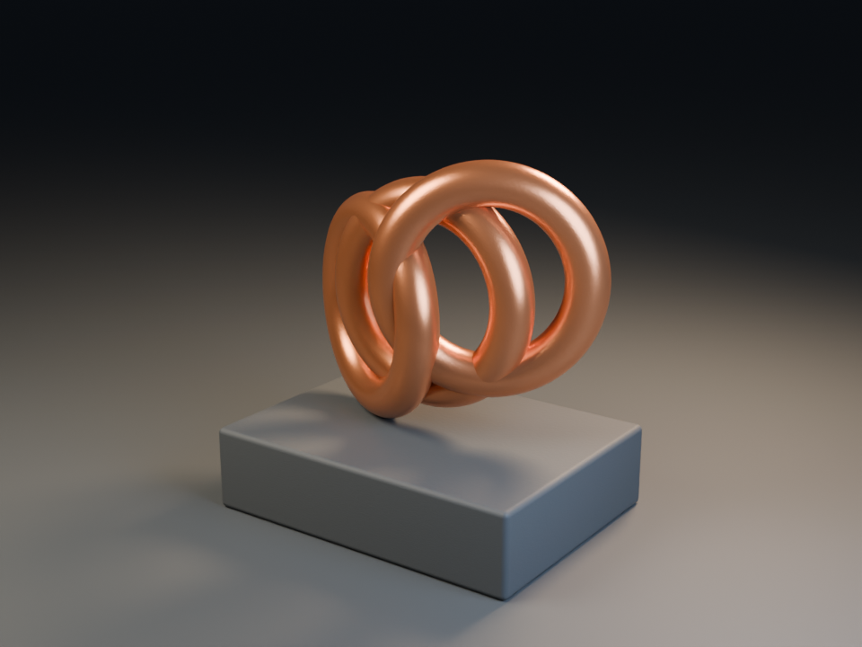

# Blender Quality Lab

**Make 3D quality review repeatable, visible and honest, including for models that cannot see.**

A companion to [Astra Blender Harness](https://github.com/AleBrito124356/astra-blender-harness), useful on its own: three executable Blender scene recipes, six controlled briefs, an isolated scene inspector that describes a scene from its geometry, technical gates, render metrics, a text report with ready-to-run fixes, a scene diff, a run aggregator and a human visual rubric. No model API or paid asset service is required.



This image is the deterministic **abstract** recipe rendered with Blender 5.2.1. It is not an AI quality benchmark.

## Quick start

Python 3.11+ is required. Blender 4.5 LTS or newer is needed for building and inspecting scenes. The current scripts were verified on Blender 5.2.1 LTS; they keep fallbacks for the 4.x APIs (legacy `action.fcurves`, `use_nodes`), but 4.5 has not been re-tested since the inspector was rewritten. Scoring, describing, measuring, diffing and summarizing need only Python: there are no runtime dependencies.

```sh
git clone https://github.com/AleBrito124356/blender-quality-lab.git
cd blender-quality-lab
python -m venv .venv
# Windows: .venv\Scripts\activate
# macOS/Linux: source .venv/bin/activate
python -m pip install -e .
blender-quality doctor                                   # which Blender will be used, and its version
blender-quality build abstract --output output/abstract  # add --render for the final 960 x 720 image
blender-quality check output/abstract/abstract.blend     # inspect + preview render + gates + report
```

`check` writes `inspection.json`, `preview.png`, `technical.json`, `report.md` and `report.json` next to the scene (`abstract.quality/`, or `--output-dir`) and prints the report. With `--strict` it exits 1 while any gate fails.

Blender is found in this order: `--blender PATH`, the `BLENDER` environment variable, `blender` on PATH, then the standard install folders, preferring the highest version. Those folders are `C:\Program Files\Blender Foundation\Blender *\blender.exe` on Windows, `/Applications/Blender*.app` on macOS, and `/usr/bin`, `/usr/local/bin`, `/snap/bin` and `/opt/blender*` on Linux. `--blender` also accepts an install folder.

Every Blender process starts with `--background --factory-startup --disable-autoexec`. Your add-ons, startup file and preferences are not loaded. Python embedded in a `.blend`, such as registered text blocks and scripted drivers, never runs. `BLENDER_USER_SCRIPTS`/`BLENDER_SYSTEM_SCRIPTS`-style overrides are removed from its environment.

`--timeout SECONDS` (default 600) stops a stuck process. A failure prints one error line plus the last lines of Blender's output, never a Python traceback. Exit code 1 means Blender or a gate failed; exit code 2 means the input was invalid. Pass `--verbose` to see Blender's own log.

## Three recipes, ready to run

| Recipe | Study | Techniques |
| --- | --- | --- |
| `product` | Sculptural ceramic lamp | Beveled edges, ceramic micro-bump, rough stone, warm/cool studio lighting |
| `abstract` | Interlocking copper orbits | Metallic response, readable silhouette, contact shadows, plinth composition |
| `interior` | Isometric reading nook | Believable scale, furniture, shelves, books, coordinated materials |

Each recipe creates a new scene with an active camera, named objects and materials, an AgX view transform and three area lights. The saved `.blend` holds only that scene. The factory scene, with its default Cube, Camera, Light and Material, is removed before saving, and so is every other unused datablock. The CLI refuses to overwrite an existing recipe `.blend`. Renders use Cycles CPU at 960 × 720 with 32 samples and denoising.

The recipes are authored procedural baselines, not model-generated results. The inspector below found three real defects in them, which are now fixed:
- the backdrop floor's top was 1.5 cm below every plinth;
- the interior shelves hovered 5 cm off the wall;
- the interior edge light was completely blocked by the back wall.

## Vision-free inspection

`blender-quality inspect scene.blend --output inspection.json` opens the file in an isolated background Blender, collects facts and never saves the scene. It takes about 0.1-0.4 s inside Blender for the recipes, plus Blender's start-up time.

The facts come from geometry, not pixels, so a model or reviewer without vision can tell what works (inspection schema 2):

- **Real render visibility.** It checks the object and every collection in the chain (`hide_render`), view-layer exclusion, `VERTS`/`FACES` instancer parents, camera ray visibility, holdout and indirect-only. Geometry is taken from the evaluated depsgraph, so modifiers, collection instances and geometry nodes count. A hidden *parent* does not hide its children in Blender, and the inspector agrees.
- **What the camera sees.** The inspector projects area-weighted surface samples (numpy, matching `bpy_extras.world_to_camera_view` to 1e-6) and ray-casts them against a BVH of every visible triangle. That gives each object's share of the surface inside the frame, the edges where it is cut off, how much of it is hidden behind other objects and by what, and a 64-column **object-ID grid** that shows which object covers each part of the frame.
- **Subject.** By default the subject is everything except large flat backdrops (floors, walls) and objects that enclose the camera. `--subject NAME_OR_GLOB` and `--subject-collection NAME` override that, for example `--subject-collection ASTRA` for the briefs that build into an ASTRA collection.
- **Grounding.** Objects are grouped by contact (triangle overlap or distance within 5 mm; `--contact-scale` changes it). A group is *floating* when it rests on nothing and has a surface below it; its gap is measured with downward rays.
- **Lighting.** For each light: whether it is aimed at the subject, which share of the camera-visible subject it actually reaches after shadow rays, what blocks it, and an approximate irradiance. From these come key, fill and the key-to-fill ratio. The world's radiance counts too, and so does emission, but only from materials on visible geometry.
- **Materials.** Shaders reachable from the active output, base color, metallic, roughness, transmission and alpha, used images, emission.
- **Animation.** Keys are read through the Blender 5 layered-action API (`channelbag(slot).fcurves`, with the legacy `action.fcurves` fallback), including NLA. It reports key ranges against the frame range, non-finite keys, Python drivers that were not evaluated, and motion sampled over the range: path length, speed, jumps, and whether the subject stays in frame.
- **Also recorded:** the camera (lens, FOV, clip range, depth of field), world, missing images (and whether they are used), units, other scenes (`--scene-name` inspects one of them instead of the active scene), and the file's SHA-256.

`inspect --preview preview.png` also renders a small final-engine preview (25% size, 16 samples by default) so exposure can be measured. A scene that cannot render (no camera, engine error) still gets its inspection, and the preview records why it was skipped.

### Technical gates

`blender-quality score inspection.json --strict` exits 1 if any gate fails. When a basic gate fails (no camera, nothing renders, collapsed transforms), the gates that depend on it are reported as failed with `blocked_by`, so one broken thing shows up as one primary failure. The gates are deliberately limited checks; the right-hand column says where they can be wrong.

| Gate | Fails when | Known false positives / negatives |
| --- | --- | --- |
| `renderable_geometry` | Nothing the camera can see produces render geometry | Volume-, point-cloud- or hair-only scenes are not raycast and fail |
| `camera` | `scene.camera` is not set | Panoramic cameras pass; the two framing gates then report "not analysed" and pass |
| `non_degenerate_world_transform` | Render geometry is non-finite or collapsed to a point/line in world space (parents included) | A helper mesh hidden by zero scale fails; flattening one axis is only a warning |
| `subject_in_frame` | Under 5% of the subject surface is in frame, or 95% of the in-frame part is hidden behind other objects | The subject heuristic can pick the wrong objects (use `--subject`); glass counts as an occluder for the camera |
| `not_cropped_or_tiny` | The subject fills under 0.5% of the frame, or under 35% of it is inside the frame | Deliberate extreme close-ups and very wide establishing shots |
| `effective_illumination` | No light reaches the subject, the world is black and no visible material emits | Shadow rays ignore see-through materials but not small gaps; a textured world counts as lit even if the HDRI is black |
| `materials` | A visible object renders geometry without a material | |
| `missing_images` | An image used by a visible material or the world is missing on disk | Images used only by modifiers, drivers or scripts are not traced; UDIM tiles are skipped |
| `resolution` | The effective resolution is under 256 × 256 | |
| `animation_keys_in_range` | A key is non-finite, or an animated object's keys all lie outside the frame range | NLA strips are judged by strip range; drivers are not evaluated |
| `grounded` (`--strict-contact` only) | A group of touching objects rests on nothing above a surface | Birds, clouds, hanging lamps without a modelled cord, intentionally floating products |

Warnings are advisory: floating groups, small subject, subject cut off or partly hidden, lights that miss or are blocked, flat or harsh key-to-fill, no fill, camera inside geometry, depth of field focused away from the subject, subject beyond the clip range, suspicious unit scale, faces without material, flattened transforms, unused missing images, truncated animation, jumps, the subject leaving the frame during animation, and Python drivers that were not evaluated.

Passing the gates does **not** prove beautiful composition, watertight geometry or license compliance. Irradiance is a relative estimate (inverse-square, cosine terms, no bounces), not a light meter.

Schema 1 inspections from older versions are still scored exactly as before: 8 gates, same output.

### Render metrics

`blender-quality measure render.png` decodes the PNG in pure Python. It handles 8/16-bit gray, gray+alpha, RGB and RGBA, 8-bit palette, and all five scanline filters, and rejects anything else with a clear error. It reports:
- Rec.709 luminance mean, standard deviation and percentiles;
- the clipped-highlight and crushed-shadow shares;
- an 8 × 8 luminance and detail grid, where the visual detail is centred, and an ASCII brightness map;
- warnings for black, underexposed, overexposed, flat and empty frames.

On the 960 × 720 reference render it matches Blender's own numpy statistics to four decimals in about 0.8 s. Transparent pixels are excluded and reported separately.

### A text report for agent loops

`blender-quality describe inspection.json [--image render.png] [--format md|json]` turns the facts into a short deterministic report. It covers the camera, the object-ID map with each object's share of the frame, where the subject sits (rule-of-thirds cell), what hides what, floating groups, light roles and key-to-fill ratio, material colors in words, animation and exposure. It ends with **prioritized fixes that include the Blender Python to apply them**. For the scene with the sculpture lifted 3 m:

```text
## Fix first

1. **'Copper orbit 1', 'Copper orbit 2', 'Copper orbit 3' float 3.002 scene units above 'Exhibition plinth' and touch nothing that reaches the ground** Lower 'Copper orbit 1', 'Copper orbit 2', 'Copper orbit 3' by 3.002 so they rest on 'Exhibition plinth'.
   `for name in ['Copper orbit 1', 'Copper orbit 2', 'Copper orbit 3']: bpy.data.objects[name].location.z -= 3.002`
2. **The subject is cut off at the top edge of the frame** Move the camera to (8.721, -12.21, 4.922) (15.16 from the subject centre) and aim it at (0.0, 0.0, 2.761).
```

The camera and light suggestions are computed: the look-at rotation matches Blender's `to_track_quat('-Z', 'Y')`, the distance fits the subject in the field of view, and the light power is sized to the distance. Exposure changes are only suggested once the gates pass, because a frame that is dark because the camera points away cannot be fixed with exposure. The integration tests apply every suggested fix to each broken scene inside Blender and require the repaired scene to pass all gates.

A loop for a model without vision:

1. The model builds or edits the scene and saves it.
2. `blender-quality check scene.blend --strict` (add `--subject-collection ASTRA` for Astra briefs).
3. The model reads `report.md`, or `report.json` for structured fields, and applies the "Fix first" items. The snippets come from this lab, not from the scene; whether to run them is the harness's decision.
4. Repeat until the exit code is 0, then render the final image and run `measure` on it.

## Evaluate a model or harness change

1. Pick a brief: `blender-quality briefs list`, then `blender-quality briefs show copper-orbits` (`--prompt-only` pipes just the prompt, `--json` gives everything). The briefs ship inside the package ([src/blender_quality/data/briefs.json](src/blender_quality/data/briefs.json)) and say which automated checks cover their criteria.
2. Record the exact model ID, harness commit, prompt, tool/vision mode, turn/token limits, Blender version and hardware. Keep the random seed and render settings fixed where supported.
3. Run each brief at least three times per configuration. Keep failures, timeouts and rejected operations.
4. Store every run as `runs/<config>/<brief>/<run>/` with:
   - `manifest.json`: `status`, `model`, `steps`/`turns`, `total_tokens`/`tokens`, `elapsed_seconds`/`elapsed`. The Astra manifest is read as-is, and `awaiting_approval_seconds` is subtracted for active time.
   - `technical.json` (from `score`), or `inspection.json`, which is scored with `--strict-contact` when the brief asks for it.
   - `human-*.json`: one filled rubric or `review` report per reviewer, ideally two blinded reviewers.
5. `blender-quality summarize runs` prints, per configuration and brief:
   - completion rate (failures and timeouts count);
   - all-gates pass rate and mean gate share;
   - human mean ± standard deviation, and the largest gap between reviewers on any rubric dimension;
   - median latency and tokens.

   It prints a Markdown table, or JSON with `--format json`. It never merges these into one ranking.

[examples/runs](examples/runs) was produced by `python examples/make_example_runs.py` from real offline Blender runs: each recipe three times, three scripted defects and a real `--timeout` stop. It holds no invented human ratings. `blender-quality summarize examples/runs` gives:

| config | brief | runs | completed | all gates pass | mean gate share | human mean +/- sd | max reviewer gap | median s | median tokens |
| --- | --- | --: | --: | --: | --: | --: | --: | --: | --: |
| procedural-recipes | ceramic-lamp | 3 | 100% | 100% | 100% | - | - | 5.98 | 0 |
| procedural-recipes | copper-orbits | 3 | 100% | 100% | 100% | - | - | 5.69 | 0 |
| procedural-recipes | reading-nook | 3 | 100% | 100% | 100% | - | - | 5.81 | 0 |
| sabotaged-recipes | copper-orbits | 4 | 75% | 0% | 88% | - | - | 5.3 | 0 |

For the **preserve-and-relight** brief, inspect the input before the run and the saved copy after it:

```sh
blender-quality diff before.json after.json --original input.blend --format md --strict
```

The diff lists added, removed and renamed objects (renames are matched by mesh hash), moves, rotations, scale, mesh, modifier and material edits, plus camera, light, world and render changes. It gives a verdict: geometry, names and materials preserved; lighting or camera changed; input file unchanged (checked by SHA-256). It is the objective ground truth for the "changes accurately reported" criterion.

`compare` still works, but it is deprecated: given a runs folder it prints the `summarize` JSON, and given report files it lists them as before.

## Human rubric

```sh
blender-quality rubric > ratings.json
# Replace every null with a score from 0 to 5; fill reviewer and evidence.
blender-quality review ratings.json > human-reviewer-a.json
```

`review` rejects unfilled scores, the `YOUR_NAME` placeholder and empty evidence.

| Dimension | Look for |
| --- | --- |
| Brief adherence | Subject, style, constraints and requested deliverable |
| Composition | Silhouette, framing, balance and focal hierarchy |
| Geometry | Proportions, intersections and intentional edges |
| Materials | Response, scale, variation and coherence |
| Lighting | Readability, contact, contrast and color |
| Finish | Artifacts, polish and readiness for the intended use |

Anchors: **0** absent/unusable; **1** major failures; **2** substantial fixes needed; **3** acceptable with visible issues; **4** polished with minor issues; **5** excellent for this particular brief. Write evidence-based notes, not just numbers. The normalized human score weights the six dimensions equally; it remains subjective.

## Integration with Astra

1. Paste a brief into Astra (`briefs show ID --prompt-only`), choose your own provider/API, run Studio quality, and download `scene.blend`, its trace and `manifest.json`.
2. Run `blender-quality check scene.blend --subject-collection ASTRA`, or `inspect` + `score` + `describe`.
3. Place the manifest and reports in the run layout above and summarize.

The `report.md` of `check` is designed to be fed back to a model that has no vision. Recommended starting models and their official sources live in the [harness README](https://github.com/AleBrito124356/astra-blender-harness#recommended-starting-models). There is no published model leaderboard here.

## Development

```sh
python -m pip install -e ".[dev]"
python -m pytest -q                 # offline: scoring, gates, metrics, describe, diff, summarize, CLI
python -m pytest -m blender -q      # needs Blender: builds and inspects 14 scenes, repairs 7 broken ones
python -m ruff check src tests examples && python -m ruff format --check src tests examples
python -m build
```

The pure-Python tests run on inspections and preview renders recorded from real Blender 5.2.1 scenes (`tests/fixtures`).
- `BQL_UPDATE_FIXTURES=1 python -m pytest -m blender` re-records the fixtures. `tests/blender/sabotage.py` shows how each broken variant is made.
- `BQL_UPDATE_SNAPSHOTS=1` accepts intended wording changes in the `describe` snapshots.

The CI template in `docs/github-actions.yml` runs lint, the offline tests and the build without downloading Blender or spending API credits. Copy it to `.github/workflows/ci.yml` and push with a workflow-enabled credential to activate it. See [validation.md](docs/validation.md) for the Blender runtime checks and [CHANGELOG.md](CHANGELOG.md) for behaviour changes.

MIT licensed. Original recipes by Alejandro Brito. Independent of the Blender Foundation.
